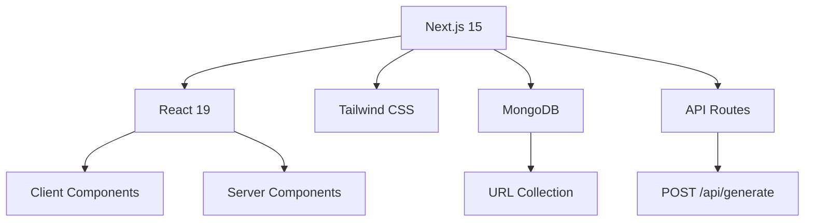

# 🔗 BitLink - URL Shortener

<div align="center">
  
  
  
  
</div>

## 📋 Table of Contents

- [🌟 Overview](#-overview)
- [✨ Features](#-features)
- [🏗️ Architecture](#️-architecture)
- [🛠️ Installation](#️-installation)
- [🚀 Usage](#-usage)
- [🔧 Configuration](#-configuration)
- [📂 Project Structure](#-project-structure)
- [🎨 UI Components](#-ui-components)
- [🔌 API Endpoints](#-api-endpoints)
- [🗄️ Database Schema](#️-database-schema)
- [🧪 Testing](#-testing)
- [📱 Screenshots](#-screenshots)
- [🤝 Contributing](#-contributing)

## 🌟 Overview

**BitLink** is a modern, privacy-focused URL shortener built with Next.js 15 and MongoDB. It provides a clean, intuitive interface for creating short URLs without collecting user data.

### 🎯 Key Highlights

- ⚡ **Lightning Fast**: Built with Next.js 15 and Turbopack
- 🔒 **Privacy First**: No user data collection
- 🎨 **Modern UI**: Beautiful interface with Tailwind CSS
- 📱 **Responsive**: Works seamlessly on all devices
- 🌐 **Full Stack**: Complete solution with API and database

## ✨ Features

### 🔥 Core Features

- ✅ **URL Shortening**: Convert long URLs to short, memorable links
- ✅ **Custom Short URLs**: Create personalized short URLs
- ✅ **Instant Redirection**: Fast URL resolution and redirection
- ✅ **Duplicate Prevention**: Prevents creation of duplicate short URLs
- ✅ **Error Handling**: Comprehensive error handling and user feedback

### 🎨 UI/UX Features

- ✅ **Beautiful Landing Page**: Engaging hero section with call-to-action
- ✅ **Interactive Forms**: Smooth form interactions and validation
- ✅ **Responsive Design**: Mobile-first design approach
- ✅ **Loading States**: Visual feedback during operations
- ✅ **Success/Error Messages**: Clear user feedback

## 🏗️ Architecture

### 🧩 Tech Stack



### 🔄 Data Flow

1. **User Input** → URL + Custom Short URL
2. **Validation** → Check for duplicates
3. **Database** → Store URL mapping
4. **Response** → Return success/error
5. **Redirection** → Short URL → Original URL

## 🛠️ Installation

### 📋 Prerequisites

- Node.js 18+ 
- MongoDB (local or Atlas)
- npm or yarn

### 🚀 Quick Start

```bash
# Clone the repository
git clone https://github.com/yourusername/bitlink.git
cd bitlink

# Install dependencies
npm install

# Set up environment variables
cp .env.example .env.local
# Edit .env.local with your MongoDB connection string

# Start MongoDB (if using locally)
brew services start mongodb-community
# or
mongod

# Run the development server
npm run dev
```

### 🌐 Open your browser

```
http://localhost:3000
```

## 🚀 Usage

### 📝 Creating Short URLs

1. **Navigate to the shorten page**
   ```
   http://localhost:3000/shorten
   ```

2. **Get your short URL**
   ```
   http://localhost:3000/mylink
   ```

### 🔗 Using Short URLs

Simply visit any short URL and get redirected:
```
http://localhost:3000/mylink → https://example.com/very-long-url
```

## 📂 Project Structure

```
bitlink/
├── 📁 app/
│   ├── 📁 api/
│   │   └── 📁 generate/
│   │       └── 📄 route.js          # URL generation API
│   ├── 📁 [shorturl]/
│   │   └── 📄 page.js               # Dynamic redirect page
│   ├── 📁 shorten/
│   │   └── 📄 page.js               # URL shortening form
│   ├── 📄 layout.js                 # Root layout
│   ├── 📄 page.js                   # Landing page
│   └── 📄 globals.css               # Global styles
├── 📁 components/
│   └── 📄 Navbar.js                 # Navigation component
├── 📁 ib/
│   └── 📄 mongodb.js                # Database connection
├── 📁 public/
│   └── 🖼️ vector.jpg                # Hero image
├── 📄 package.json
├── 📄 tailwind.config.js
└── 📄 README.md
```
### 🎯 Test Cases

- ✅ Valid URL shortening
- ✅ Duplicate short URL prevention
- ✅ Invalid URL handling
- ✅ Empty input validation
- ✅ Database connection errors
- ✅ Successful redirection
- ✅ Non-existent short URL handling

## 📱 Screenshots

### 🏠 Landing Page
```
🌟 Modern hero section with gradient background
📱 Responsive grid layout
🎨 Purple theme with hover effects
```

### 📝 Shorten Form
```
📋 Clean input form
🔗 Real-time URL generation
✅ Success/error feedback
```

### 🔄 Redirection
```
⚡ Instant URL resolution
🔀 Seamless redirection
🏠 Fallback to homepage
```


## 🤝 Contributing

### 📋 Development Setup

```bash
# Fork the repository
git fork https://github.com/yourusername/bitlink

# Create feature branch
git checkout -b feature/awesome-feature

# Make changes and commit
git commit -m "Add awesome feature"

# Push to branch
git push origin feature/awesome-feature

# Create Pull Request
```

### 📝 Code Style

- Use ES6+ features
- Follow React best practices
- Use Tailwind CSS for styling
- Add comments for complex logic
- Write descriptive commit messages

## 📄 License

This project is licensed under the MIT License - see the [LICENSE](LICENSE) file for details.

<div align="center">
  <p>Made with ❤️ by <a href="https://github.com/lunixroot">Lunixroot</a></p>
  <p>⭐ Star this repo if you like it!</p>
</div>
